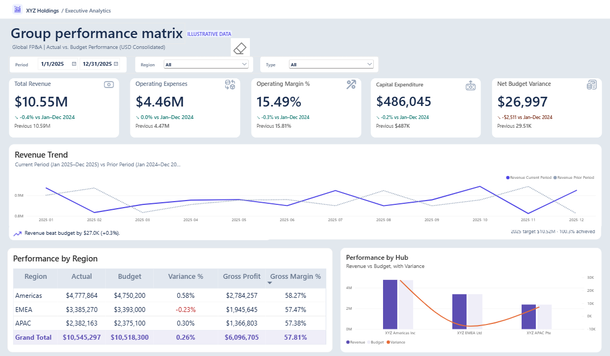

# Multi-Entity Financial Variance & Consolidation Analytics Platform

An end-to-end Corporate FP&A reporting solution designed for multi-entity enterprise operations (Americas, APAC, EMEA). The system replaces manual, error-prone spreadsheet consolidation workflows with an automated, ACID-compliant SQL Server data mart and an executive-tier Power BI dashboard featuring dynamic Period-over-Period (PoP) comparison logic.

---

## Executive Dashboard Overview



---

## Business Problem & Solution Architecture

### As-Is vs. To-Be Process Transformation

Prior to this solution, monthly financial consolidation required 5 business days of manual extraction, XLOOKUP manipulation, and spreadsheet exchanges—introducing latency, risk of formula errors, and no verifiable audit trail.

- **Latency Reduction:** Month-end financial consolidation latency reduced from **5 business days to < 1 second** post-GL close.
- **Integrity Gate:** Automated zero-cent variance reconciliation check between transaction-level details and materialized cubes (`Source - Target = $0.00`).
- **Governance:** Persistent audit trail (`dbo.LoadLog`) logging run timestamps, execution status, and affected row counts for compliance.

---

## Data Model & Schema Architecture

The warehouse implements a Star Schema optimized for corporate general ledger analytics:

- **Dimensions:**
  - `DimDate`: Calendar master with fiscal year, quarter, month, and weekday flags.
  - `DimLegalEntity`: Operating hubs (`Americas`, `EMEA`, `APAC`) mapped to local functional currencies.
  - `DimGeneralLedger`: Chart of Accounts structured into `Revenue`, `Cost of Sales`, `OPEX`, and `CAPEX`.

- **Facts:**
  - `FactFinancialTransactions`: Granular GL line items tracking daily actuals and budget allocations.
  - `FactMonthlyFinancialSummary`: Materialized monthly analytical cube populated via stored procedure.
  - `LoadLog`: Pipeline execution tracking table with audit status and error traps.

---

## Financial Reconciliation & Audit Logging

The pipeline enforces an ACID-compliant consolidation procedure (`sp_Consolidate_Financial_Cube`) wrapped in transactions with automatic rollback handling.

```sql
-- Reconciliation Execution Output
FactActual      SummaryActual    ActualDelta    FactBudget      SummaryBudget    BudgetDelta    ReconciliationStatus
10545297.00     10545297.00      0.00           10518300.00     10518300.00      0.00           PASSED: 100% RECONCILED TO THE CENT
